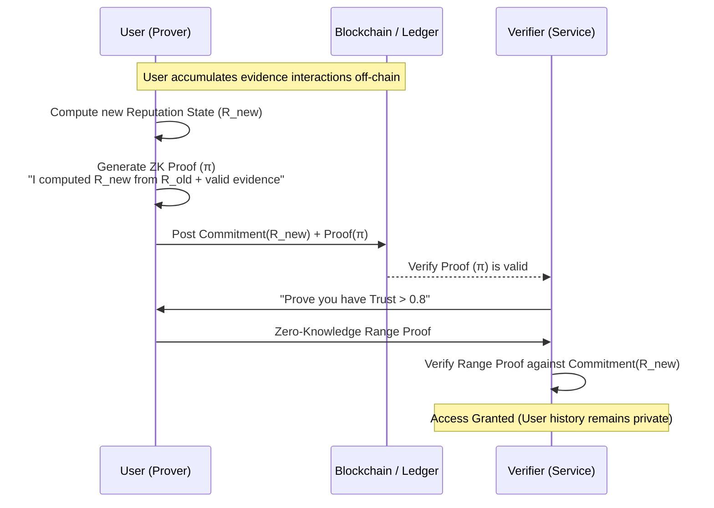

# EQBSL: Potential Uses and Applications Report

**Date:** February 21, 2026
**Project:** EQBSL (Evidence-Based Quantum-resistant Belief State Logic)

---

## 1. Executive Summary

EQBSL represents a paradigm shift in how digital systems model trust. Unlike traditional "trust scores" which reduce complex reputations to a single, opaque number (e.g., a credit score or a 5-star rating), EQBSL provides a mathematically rigorous framework for **Verifiable Epistemic Trust**.

By combining **Subjective Logic** (which explicitly models uncertainty), **Zero-Knowledge Proofs** (which ensure privacy), and **Vectorized Evidence** (which captures context), EQBSL enables decentralized systems to reason about trust in a way that is:
*   **Expressive:** Distinguishing between "trusted", "distrusted", and "unknown".
*   **Private:** Proving reputation without revealing sensitive interaction history.
*   **Resilient:** Resistant to Sybil attacks and quantum decryption threats.

---

## 2. Core Concepts

### 2.1 Evidence-Based Subjective Logic (EBSL)
At the heart of the system is the **Opinion Tuple** $\omega = (b, d, u, a)$, where:
*   **$b$ (Belief):** Weight of positive evidence.
*   **$d$ (Disbelief):** Weight of negative evidence.
*   **$u$ (Uncertainty):** Lack of evidence. As evidence increases, $u$ decreases.
*   **$a$ (Base Rate):** Prior probability in the absence of information.

This mapping allows systems to calculate trust dynamically:
$$b = \frac{r}{r+s+K}, \quad d = \frac{s}{r+s+K}, \quad u = \frac{K}{r+s+K}$$
*(Where $r$ is positive evidence, $s$ is negative evidence, and $K$ is a protocol constant)*

### 2.2 Proof-Carrying Trust (ZK-EBSL)
Trust updates are not just computed; they are **proven**. Using Zero-Knowledge Machine Learning (ZKML) techniques, an entity can prove that their new reputation score was correctly calculated from valid evidence without revealing *what* that evidence was (e.g., who they traded with or the specific transaction details).

### 2.3 Vectorized & Hypergraph Trust
Real-world interactions are rarely just pairwise. EQBSL models:
*   **Evidence Tensors:** Multidimensional evidence (e.g., distinguishing "late delivery" from "broken item").
*   **Hypergraphs:** Interactions involving multiple parties (e.g., a DAO committee vote).

---

## 3. Potential Uses and Applications

### 3.1 Decentralized Identity (DID) & Verifiable Credentials
**Problem:** Current DIDs are often static. "Verifiable Credentials" prove *attributes* (e.g., "over 18") but not *reputation* (e.g., "reliable borrower").
**EQBSL Solution:**
*   **Dynamic Reputation:** Identities accumulate a "Belief Tensor" over time.
*   **Privacy-Preserving Attestations:** A user can prove "I have a reputation > 0.8 in the 'finance' context" without revealing their entire transaction history.
*   **Sybil Resistance:** New identities start with maximum Uncertainty ($u \approx 1$). Systems can filter out low-confidence actors regardless of their claimed belief score.

### 3.2 DeFi & DAO Governance
**Problem:** "One token, one vote" leads to plutocracy. "One person, one vote" is vulnerable to Sybil attacks.
**EQBSL Solution:**
*   **Reputation-Weighted Voting:** Voting power scales with reputation *and* certainty. A veteran member with high belief has more weight than a fresh account.
*   **Under-Collateralized Lending:** Creditworthiness is modeled as a belief state. High trust ($b > 0.9, u < 0.1$) allows for lower collateral requirements.
*   **Quadratic Funding Filtering:** Use EQBSL uncertainty metrics to discount donations from likely Sybil clusters.

### 3.3 Supply Chain & IoT
**Problem:** Counterfeiting and lack of transparency. A "verified" checkmark doesn't tell you *how* verified an item is.
**EQBSL Solution:**
*   **Probabilistic Provenance:** Each step in the supply chain adds evidence ($r$). A final product's "authenticity" is a derived opinion. If a supplier is shady, the downstream Uncertainty ($u$) spikes.
*   **Automated Quality Assurance:** IoT sensors feed positive ($r$) or negative ($s$) evidence directly into the product's belief state.

### 3.4 AI Safety & Agent Alignment
**Problem:** AI agents are black boxes. We don't know if we can trust their outputs.
**EQBSL Solution:**
*   **Verifiable Inference:** ZKML proves that an AI model ran correctly.
*   **Trust Embeddings:** Agents maintain trust embeddings for other agents. An AI swarm can identify and isolate a hallucinating or malicious unit by fusing opinions ($b_{consensus}$ drops, $d_{consensus}$ rises).

### 3.5 Social Web & Content Moderation
**Problem:** Bot armies and polarization.
**EQBSL Solution:**
*   **"Proof of Human Work" Integration:** Trust scores that decay over time require constant, genuine participation to maintain.
*   **Bridging Polarization:** The "Uncertainty" metric helps distinguish between "I disagree with this person" ($d$ is high) and "I don't know this person" ($u$ is high), allowing algorithms to recommend content that builds bridges rather than echo chambers.

---

## 4. Technical Architecture Diagrams

### 4.1 The Evidence-to-Trust Pipeline
This diagram illustrates how raw interactions are transformed into verifiable reputation embeddings.

```mermaid
graph TD
    subgraph Data Layer
        E[Raw Events / Interactions] -->|Extraction| VT[Evidence Tensors e_ij]
    end

    subgraph Logic Layer
        VT -->|EBSL Mapping| O[Opinion Tuple (b, d, u, a)]
        O -->|Fusion Operator| F[Fused Network Opinion]
        O -->|Discounting Operator| T[Transitive Trust]
    end

    subgraph ZK Layer
        F -->|Circuit Generation| C[ZK Circuit]
        T -->|Circuit Generation| C
        C -->|Prover| P[ZK Proof]
    end

    subgraph Application Layer
        P -->|Verification| V[Verified State]
        V -->|Embedding| TE[Trust Embedding u_i]
        TE -->|Downstream| ML[ML Models / Access Control]
    end
    
    style E fill:#f9f,stroke:#333
    style TE fill:#bbf,stroke:#333
```

### 4.2 Privacy-Preserving Reputation Check
How a user proves their trustworthiness to a service without doxxing themselves.



---

## 5. Comparison: EQBSL vs. Traditional Trust Systems

| Feature | Traditional Trust Score | Web-of-Trust (PGP) | EQBSL System |
| :--- | :--- | :--- | :--- |
| **Representation** | Scalar (e.g., 5.0 stars, 750 credit) | Boolean (Trusted/Untrusted) | **Tuple (Belief, Disbelief, Uncertainty)** |
| **Evidence** | Hidden / Proprietary | Public Signatures | **Vectorized & Private (ZK)** |
| **Transitivity** | Centralized Algorithm | Manual / Short paths | **Mathematical Discounting Operators** |
| **Privacy** | Low (Centralized DB) | Low (Public Graph) | **High (Zero-Knowledge Proofs)** |
| **Sybil Resistance**| ID Verification (KYC) | Reliance on Introducers | **Epistemic Uncertainty (High 'u')** |
| **Quantum Safety** | Low (RSA/ECC) | Low (RSA/ECC) | **High (PQ-Commitments)** |
| **Granularity** | Coarse (Global Score) | Binary | **Context-Aware (Multi-dimensional)** |

---

## 6. Implementation Readiness
The current codebase (`/src`) provides the foundational components for this system:
*   `EbslService`: Implements the core $b, d, u$ calculus.
*   `zk-demo.component`: visualizes the ZK proof flow.
*   `eqbsl-graph`: Visualizes the dynamic trust network.

**Next Steps for Deployment:**
1.  Replace mock ZK proofs with actual ZKML circuits (e.g., using Halo2 or Noir).
2.  Implement the "Belief Tensor" storage on a decentralized storage layer (IPFS/Arweave).
3.  Deploy the Verifier contracts to an EVM-compatible chain.
