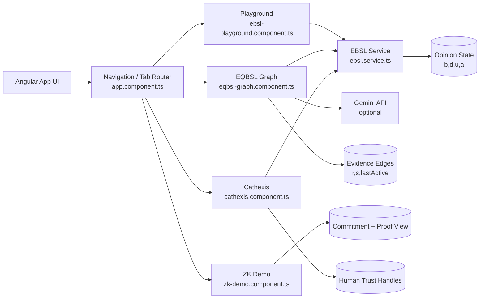
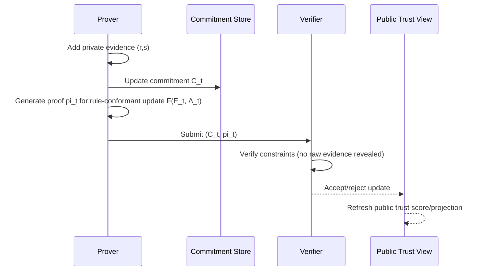

# EQBSL System: Uses and Applications Report

## 1. Executive Summary

EQBSL Explorer demonstrates a trust-computation system that treats trust as an evidential state rather than a scalar score. In the current implementation, trust is represented with Evidence-Based Subjective Logic (EBSL) tuples and opinions (`r`, `s` -> `b`, `d`, `u`) in `src/services/ebsl.service.ts`, surfaced through four interactive operational layers:

- EBSL opinion computation (`src/components/ebsl-playground.component.ts`)
- Dynamic trust network simulation (`src/components/eqbsl-graph.component.ts`)
- Privacy-preserving proof workflow demo (`src/components/zk-demo.component.ts`)
- Human-readable trust interpretation via Cathexis labels (`src/components/cathexis.component.ts`)

This combination supports high-value applications where systems must reason under uncertainty, prove rule-conformance, and communicate trust states to users and operators.

## 2. System Capability Baseline

### 2.1 What the current system already supports

| Capability | Current Implementation | Practical Meaning |
|---|---|---|
| Opinion from evidence | `calculateOpinion(r,s,a)` with `K=2` in `ebsl.service.ts` | Converts interactions into belief/disbelief/uncertainty with explicit unknown-state handling |
| Expected trust value | `expectedProbability()` in `ebsl.service.ts` | Produces a decision-friendly score while preserving uncertainty in the underlying model |
| Dynamic trust graph | Autonomous edge growth, decay, role behavior in `eqbsl-graph.component.ts` | Simulates trust formation, drift, and adversarial dynamics in multi-actor networks |
| Temporal degradation | Edge decay + stale culling in `decayEdges()` | Models trust staleness and relationship atrophy over time |
| Role/integrity controls | Role switching + reliability tuning in node inspector | Lets operators test honest/mixed/malicious behavior profiles |
| ZK verification pattern | Prover/verifier split in `zk-demo.component.ts` | Demonstrates proving update-rule compliance without exposing raw evidence |
| Semantic trust labels | `getCathexisLabel(r,s)` plus optional LLM-generated handles | Maps quantitative trust vectors into operator-friendly narratives |
| AI-assisted identity annotation | `generateAIHandle()` using Gemini API key | Enhances explainability/UX in large trust graphs |

### 2.2 High-level architecture



## 3. Trust Lifecycle and Operational Mechanics

### 3.1 Evidence-to-opinion lifecycle

```mermaid
flowchart TD
  A[Interaction occurs] --> B{Outcome quality?}
  B -->|Positive| C[Increment r]
  B -->|Negative| D[Increment s]
  C --> E[Recompute opinion\nb=r/(r+s+2)\nd=s/(r+s+2)\nu=2/(r+s+2)]
  D --> E
  E --> F[Compute expectation\nE(w)=b+0.5*u]
  F --> G[Update edge rendering\nwidth/color/opacity]
  F --> H[Update node reputation\nfrom incoming evidence]
  H --> I[Assign Cathexis semantic label]
  I --> J[Operator decision / policy action]
```

### 3.2 Privacy-preserving trust assertion flow



## 4. Application Landscape

### 4.1 Priority domains and fit

| Domain | EQBSL Use Case | Why EQBSL Is Better Than Scalar Scores | Minimum Required Components | Readiness |
|---|---|---|---|---|
| Decentralized identity (DID/SSI) | Verifiable issuer/relying-party trust with uncertainty-aware attestations | Distinguishes “unknown” from “bad”; supports evidence-backed trust evolution | EBSL core + graph + ZK constraints | High (prototype-ready) |
| Marketplaces (B2B/B2C) | Vendor reputation with fraud/defect evidence and decay | Prevents reputation inflation from sparse ratings and stale feedback | EBSL core + decay + policy thresholds | High |
| Validator/staking ecosystems | Node/operator trust for delegation and slashing risk | Encodes both reliability and uncertainty, not only uptime averages | Graph simulator + role/integrity modeling + evidence pipelines | Medium-High |
| Supply chain provenance | Trust on suppliers, carriers, certifiers, and checkpoints | Captures conflicting claims and missing evidence explicitly | EBSL core + graph + proof-carrying attestations | Medium |
| Federated AI agents | Agent trust arbitration before tool execution or delegation | Enables uncertainty-aware routing and guardrails | EBSL core + Cathexis + policy engine | Medium |
| Compliance/audit workflows | Prove policy-compliant trust updates without disclosing PII | ZK pattern aligns with least-disclosure and auditability goals | ZK circuits + commitment lifecycle + verifier logs | Medium |
| Content/reputation moderation | Confidence-weighted actor credibility and report handling | Reduces overreaction to low-evidence spikes | EBSL core + temporal decay + investigator UX labels | Medium |
| Public-sector procurement | Transparent contractor trust under partial evidence | Better handling of sparse and conflicting procurement history | EBSL core + explainability layer + governance dashboard | Medium-Low |

### 4.2 Typical actors and decisions

| Actor | Decision Supported by EQBSL | Signals Used |
|---|---|---|
| Marketplace risk team | Approve, flag, or throttle seller activity | Edge-level `r/s`, uncertainty `u`, trend/decay |
| Delegator/staker | Select validator set | Role, reliability trajectory, incoming trust evidence |
| Credential verifier | Accept or request additional proof | Opinion tuple, base-rate expectation, proof validity |
| Policy engine | Trigger gating thresholds | `E(w)` + minimum evidence + uncertainty ceiling |
| End-user | Interpret trust quickly | Cathexis handles + compact opinion bars |

## 5. Detailed Application Patterns

### 5.1 Identity and access trust gating

- Pattern: replace binary allow/deny with evidence-backed confidence tiers.
- Example policy:
  - `Allow` if `E(w) >= 0.80` and `u <= 0.20`
  - `Step-up verification` if `0.55 <= E(w) < 0.80` or `u > 0.20`
  - `Deny/quarantine` if `E(w) < 0.55` with minimum evidence count reached
- Benefit: avoids false certainty for new identities.

### 5.2 Marketplace anti-fraud and anti-Sybil control

- Pattern: track interaction outcomes as edge evidence and identify malicious clusters.
- Existing support in system: explicit Sybil role defaults + reliability tuning + network evolution/decay.
- Benefit: richer fraud heuristics than star ratings alone.

### 5.3 Trust-aware routing in distributed systems

- Pattern: choose counterparties/services based on expectation while preserving exploration.
- Existing analogue: `findInteractionTarget()` uses exploit/explore blend in mature graph mode.
- Benefit: balances short-term reliability with long-term discovery.

### 5.4 Privacy-preserving compliance attestations

- Pattern: keep transaction evidence private; publish proof that trust updates followed approved rules.
- Existing analogue: prover/verifier interaction in ZK demo.
- Benefit: auditable integrity without sensitive-data leakage.

### 5.5 Human-centered trust operations

- Pattern: attach semantic labels to quantitative trust state for operational clarity.
- Existing support: Cathexis labels (`Unknown Entity`, `Reliable Operator`, `High-Risk Actor`, etc.) plus AI handle generation.
- Benefit: faster analyst comprehension and better cross-team communication.

## 6. Risks, Limits, and Required Hardening

### 6.1 Current limitations visible in code

| Area | Current State | Impact | Hardening Priority |
|---|---|---|---|
| Opinion fusion | `fuseOpinions()` returns `op1` placeholder | Multi-source consensus is not yet production-complete | P0 |
| ZK module | Demo simulation with mocked proof outputs | Not cryptographically enforceable yet | P0 |
| Data persistence | In-memory runtime state for graph interactions | No longitudinal trust history | P0 |
| Identity integrity | Optional AI handle generation can fail silently | Non-deterministic UX naming layer | P2 |
| Adversarial modeling depth | Basic reliability probabilities + random failures | Limited realism for advanced attacks | P1 |
| Governance/policy engine | No standalone policy service | Manual interpretation burden on operators | P1 |

### 6.2 Threat model and mitigations

| Threat | Failure Mode | Mitigation Strategy |
|---|---|---|
| Sybil amplification | Fake identities collude to inflate trust | Minimum-evidence thresholds, graph-community anomaly detection, stake/cost constraints |
| Cold-start bias | New entities penalized or misclassified | Explicit uncertainty handling and probationary policies |
| Reputation gaming | Strategic behavior to farm positive evidence | Time-weighted evidence decay, context partitioning, adversarial scoring |
| Data poisoning | Malicious reporters inject false negatives/positives | Source credibility weighting and cross-source correlation checks |
| Privacy leakage | Raw trust evidence exposed in audits | Commitment schemes + ZK proof verification |
| Model drift | Static thresholds become stale | Periodic recalibration using KPI feedback loops |

## 7. KPI Framework for Real Deployments

| KPI Category | Metric | Target Example | Why It Matters |
|---|---|---|---|
| Trust quality | False accept rate on high-risk actors | < 2% | Measures safety of trust gating |
| Trust quality | False reject rate on legitimate actors | < 5% | Measures fairness and friction |
| Epistemic quality | Median uncertainty for active entities | Downward trend over 90 days | Confirms evidence accumulation health |
| Security | Sybil cluster detection lead time | < 24h | Measures adversary response speed |
| Privacy | % trust updates with verifiable proof | > 95% in regulated flows | Confirms privacy-preserving integrity |
| Operations | Analyst time-to-decision | -30% from baseline | Measures UX/explainability value |
| Product | Conversion after trust-gated onboarding | +10% vs control | Demonstrates business impact |

## 8. 30/60/90-Day Adoption Blueprint

| Phase | Objectives | Deliverables |
|---|---|---|
| Day 0-30 | Formalize trust policy and data model | Evidence schema, threshold policy, domain-specific trust contexts |
| Day 31-60 | Integrate runtime trust graph and persistence | Event ingestion pipeline, stored trust ledgers, dashboards |
| Day 61-90 | Add proof and governance controls | Verifier service, audit export, model calibration and red-team tests |

## 9. Recommended Near-Term Productization Path

1. Implement real cumulative fusion in `fuseOpinions()` with tests.
2. Add persistent trust ledger (append-only events + derived opinion snapshots).
3. Externalize policy thresholds into a configurable policy engine.
4. Replace ZK demo placeholders with concrete circuit/proof stack for one critical workflow.
5. Add domain profiles (marketplace, DID, validator, supply chain) as reusable presets in UI.

## 10. Conclusion

EQBSL’s strongest practical value is not just “better trust scoring”; it is the combination of:

- mathematically explicit uncertainty,
- graph-native trust dynamics,
- privacy-preserving verification patterns,
- and human-readable trust semantics.

The current system already demonstrates these pillars in interactive form. With fusion completion, persistence, and production-grade ZK verification, EQBSL can serve as a trust substrate for identity, marketplaces, validator ecosystems, compliance-heavy workflows, and agentic systems that must reason under uncertainty.
