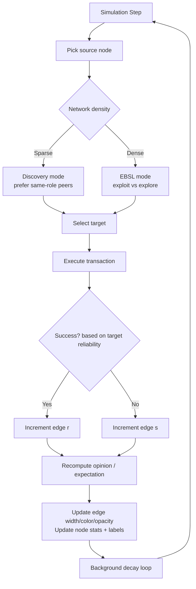
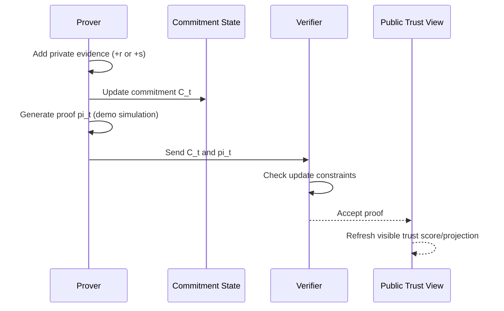

# EQBSL Explorer

[](https://github.com/Steake/EQBSL)
[](https://angular.io)
[](https://www.typescriptlang.org/)

**EQBSL Explorer** is an interactive web application for experimenting with mathematically-grounded trust systems and verifiable epistemic reasoning.

Live demo: https://eqbsl-demo.netlify.app/

It provides hands-on tools for:

- **Evidence-Based Subjective Logic (EBSL)**: represent trust as evidence and uncertainty, not just a scalar score
- **ZK-EBSL / Proof-Carrying Trust**: prove trust updates follow rules without revealing private evidence
- **EQBSL graph reasoning**: model trust as dynamic network interactions with decay and adversarial actors
- **Cathexis labeling**: convert quantitative trust states into human-readable semantic labels

Built with Angular 21 + TypeScript, the project makes trust, reputation, and epistemic uncertainty explorable in a visual interface.

> **Repository:** [`Steake/EQBSL`](https://github.com/Steake/EQBSL)  
> **App metadata:** [`metadata.json`](./metadata.json)

---

## What EQBSL Solves

Most reputation systems collapse rich trust states into one number (for example, `4.7/5`). That loses key information:

- how much evidence exists (`2 reviews` vs `20,000 reviews`)
- whether evidence is conflicting
- whether trust is stale
- whether a verifier can validate trust updates without seeing private data

EQBSL (Evidence-based Quantum-resistant Belief State Logic) models the epistemic state directly:

- **Belief (`b`)**: evidence supporting a proposition
- **Disbelief (`d`)**: evidence against a proposition
- **Uncertainty (`u`)**: absence of evidence
- with the constraint `b + d + u = 1`

### Core EBSL mapping used in this repo

The `EbslService` computes opinions from evidence (`r`, `s`) using the standard demo parameter `K = 2`:

- `b = r / (r + s + 2)`
- `d = s / (r + s + 2)`
- `u = 2 / (r + s + 2)`
- `E(w) = b + a*u` (expected probability, with base rate `a`, default `0.5`)

This is implemented in [`src/services/ebsl.service.ts`](./src/services/ebsl.service.ts).

---

## System Overview (Actual App Components)

The app is organized into standalone Angular components selected from a tabbed shell in [`src/app.component.ts`](./src/app.component.ts).

### High-level architecture

```mermaid
flowchart LR
  APP[App Shell\napp.component.ts] --> NAV[Navigation\nnav.component.ts]
  APP --> INTRO[Overview / Intro]
  APP --> EBSLPLAY[EBSL Playground]
  APP --> GRAPH[EQBSL Graph]
  APP --> ZK[ZK Demo]
  APP --> CATHEXIS[Cathexis]
  APP --> PAPERS[Papers + Paper Detail]

  EBSLPLAY --> SVC[EBSL Service\nebsl.service.ts]
  GRAPH --> SVC
  CATHEXIS --> SVC

  GRAPH --> GEMINI[Gemini API (Optional)\nAI Handle Generation]
  ZK --> COMMIT[Commitment + Proof UI]
  CATHEXIS --> LABELS[Human-readable Trust Labels]
```

### Trust data lifecycle in the graph simulation

The graph visualizer in [`src/components/eqbsl-graph.component.ts`](./src/components/eqbsl-graph.component.ts) simulates autonomous actors, edge evidence growth, and trust decay.



### Privacy-preserving trust flow (demo pattern)

The ZK demo in [`src/components/zk-demo.component.ts`](./src/components/zk-demo.component.ts) demonstrates the prover/verifier interaction model.



---

## Key Features (What You Can Do in the UI)

### 1. EBSL Logic Calculator

[`src/components/ebsl-playground.component.ts`](./src/components/ebsl-playground.component.ts)

- Adjust positive evidence `r` and negative evidence `s`
- Observe belief/disbelief/uncertainty bars update in real time
- See expected probability `E(w)` computed from the opinion tuple
- Visualize why uncertainty decays only with accumulated evidence

### 2. EQBSL Graph Visualizer

[`src/components/eqbsl-graph.component.ts`](./src/components/eqbsl-graph.component.ts)

- Simulate multi-actor trust networks with autonomous interactions
- Model roles (`Validator`, `Trader`, `Observer`, `Sybil`)
- Tune hidden reliability and observe behavioral divergence
- Inspect incoming/outgoing evidence per node
- Watch stale trust relationships decay over time
- Generate AI-based semantic handles (optional API key)

### 3. Proof-Carrying Trust (ZK Demo)

[`src/components/zk-demo.component.ts`](./src/components/zk-demo.component.ts)

- Simulate private evidence updates
- Produce a commitment/proof pair (demo UX)
- Verify rule-conformance without exposing raw evidence
- Understand the separation between private state and public trust view

### 4. Cathexis Trust Labels

[`src/components/cathexis.component.ts`](./src/components/cathexis.component.ts)

- Map trust vectors to human-readable labels
- Preview reputation semantics for new, reliable, mixed, and malicious actors
- Demonstrate operator-friendly explainability for trust tensors

---

## Real-World Use Cases

### Use-case matrix

| Domain | Example Deployment | Why EQBSL Helps | Relevant App Modules |
|---|---|---|---|
| Decentralized identity (DID/SSI) | Verifier decides whether to trust an issuer under sparse history | Distinguishes “unknown” from “bad”; supports privacy-preserving checks | EBSL + ZK + Cathexis |
| Marketplaces | Vendor/reviewer reputation with fraud resistance | Models evidence volume, conflict, and decay; reduces rating inflation | EBSL + Graph |
| Validator/staking networks | Delegator chooses validators under uncertainty | Captures reliability and uncertainty, not only uptime averages | Graph + EBSL |
| Supply chain provenance | Trust in suppliers, certifiers, transport checkpoints | Handles missing/conflicting evidence and auditability requirements | EBSL + ZK |
| AI agents / tool orchestration | Gate agent actions based on trust in tools/peers | Supports uncertainty-aware routing and policy thresholds | EBSL + Cathexis |
| Moderation / trust & safety | Prioritize reports and actor reviews | Avoids overreacting to low-evidence events; supports analyst triage | Graph + Cathexis |
| Compliance-heavy workflows | Prove policy-compliant trust updates without PII disclosure | Separates public verification from private evidence | ZK demo pattern |

### Example examples (worked scenarios)

#### Example 1: New identity vs bad identity (same score problem)

A scalar system might give both actors a low/neutral score for different reasons. EQBSL separates them.

| Actor | Evidence `(r,s)` | Opinion `(b,d,u)` using K=2 | Interpretation |
|---|---:|---|---|
| New issuer | `(0,0)` | `(0.00, 0.00, 1.00)` | Unknown, no evidence |
| Risky issuer | `(0,8)` | `(0.00, 0.80, 0.20)` | Strong evidence against |

This difference is operationally critical for identity onboarding and fraud review.

#### Example 2: Marketplace seller trust thresholding

A policy engine can use both expected trust and uncertainty:

- `Allow fast checkout` if `E(w) >= 0.80` and `u <= 0.20`
- `Require manual review` if `0.55 <= E(w) < 0.80` or `u > 0.20`
- `Throttle / quarantine` if `E(w) < 0.55` with sufficient evidence

Worked values with `a = 0.5`:

| Seller | `(r,s)` | `b` | `d` | `u` | `E(w)` | Decision |
|---|---:|---:|---:|---:|---:|---|
| A | `(18,2)` | `0.818` | `0.091` | `0.091` | `0.864` | Allow fast checkout |
| B | `(4,1)` | `0.571` | `0.143` | `0.286` | `0.714` | Manual review |
| C | `(2,9)` | `0.154` | `0.692` | `0.154` | `0.231` | Throttle/quarantine |

#### Example 3: Validator selection under uncertainty

Two validators can have similar raw uptime percentages but different evidence volumes.

| Validator | Observed evidence | Trust implication |
|---|---|---|
| `V1` | `r=9, s=1` | Good performance, moderate confidence |
| `V2` | `r=900, s=100` | Similar ratio, much lower uncertainty and stronger basis for delegation |

EQBSL makes this distinction explicit instead of hiding it in a single percentage.

#### Example 4: Privacy-preserving compliance attestation

A verifier needs to know whether a trust update followed policy, but not the underlying transaction details.

- Prover maintains private evidence history
- Prover publishes updated commitment `C_t`
- Prover submits proof `π_t` that update rule `F(E_t, Δ_t)` was followed
- Verifier checks proof and accepts public trust projection

This is the model illustrated in the ZK demo component.

---

## Why This Matters in Production Systems

### Compared to scalar reputation scores

| Capability | Scalar Score | EQBSL-style Opinion Model |
|---|---|---|
| Represents uncertainty directly | No | Yes (`u`) |
| Distinguishes new vs bad actor | Often no | Yes |
| Supports evidence count reasoning | Weak | Native (`r`,`s`) |
| Supports trust decay semantics | Usually custom add-on | Fits naturally in temporal updates |
| Supports privacy-preserving verification patterns | Rare | Designed for integration with ZK workflows |
| Human explainability | Superficial labels | Quantitative + semantic labels (Cathexis) |

### Practical adoption path

1. Start with EBSL-only scoring for one workflow (e.g., vendor risk).
2. Add uncertainty-aware policy thresholds (`E(w)` + `u`).
3. Add graph-level evidence aggregation and decay.
4. Add semantic labels for analyst UX.
5. Add proof-carrying trust for regulated/high-sensitivity flows.

---

## Video Explainer

Watch the full introduction:

<video src="./Verifiable_Epistemic_Trust.mp4" controls width="100%"></video>

The video covers:

- limitations of traditional trust scores
- EBSL uncertainty modeling
- zero-knowledge trust verification concepts
- quantum-resistant extensions
- real-world applications for identity and reputation systems

---

## Research Basis

The `Papers/` directory contains the current research papers used to ground this implementation:

- **EBSL in ZK Reputation Systems** (`Papers/EBSL in ZK Reputation Systems.pdf`)
- **EQBSL+ZK** (`Papers/EQBSL+ZK.pdf`)
- **Proof-Carrying-Trust** (`Papers/Proof-Carrying-Trust.pdf`)

The in-app papers browser is implemented in:

- [`src/components/papers.component.ts`](./src/components/papers.component.ts)
- [`src/components/paper-detail.component.ts`](./src/components/paper-detail.component.ts)

---

## Getting Started

### Prerequisites

- **Node.js** 18+ (LTS recommended)
- **npm** (bundled with Node.js)
- **Optional:** Google Generative AI API key for AI-generated handles in the graph visualizer

### Install

```bash
git clone https://github.com/Steake/EQBSL.git
cd EQBSL
npm install
```

### Run locally

```bash
npm run dev
```

Then open the local URL shown by Angular CLI (typically `http://localhost:4200`).

### Optional: enable AI handle generation

Unix/macOS:

```bash
export API_KEY="your-api-key-here"
npm run dev
```

Windows (cmd):

```cmd
set API_KEY=your-api-key-here
npm run dev
```

If no API key is set, the app still works; only AI identity generation in the EQBSL graph is disabled.

### Build and preview

```bash
npm run build
npm run preview
```

---

## Project Structure

```text
EQBSL/
├── Papers/                    # Research papers (PDFs)
├── src/
│   ├── app.component.ts       # Main Angular app shell and tab routing
│   ├── services/
│   │   └── ebsl.service.ts    # EBSL opinion calculations + Cathexis label rules
│   └── components/
│       ├── intro.component.ts
│       ├── nav.component.ts
│       ├── ebsl-playground.component.ts
│       ├── eqbsl-graph.component.ts
│       ├── zk-demo.component.ts
│       ├── cathexis.component.ts
│       ├── papers.component.ts
│       └── paper-detail.component.ts
├── index.tsx                  # TS bootstrap entry
├── index.html                 # HTML entry point
├── angular.json               # Angular CLI config
├── package.json               # Dependencies and scripts
├── metadata.json              # App metadata
└── Verifiable_Epistemic_Trust.mp4
```

---

## Available Scripts

| Command | Description |
|---|---|
| `npm run dev` | Start Angular development server |
| `npm run build` | Production build |
| `npm run preview` | Serve with production configuration |

---

## Technology Stack

- **Angular 21** (standalone components, signals)
- **TypeScript 5.x**
- **RxJS**
- **Tailwind CSS**
- **Google Generative AI (`@google/genai`)** for optional handle generation
- **KaTeX** (used in paper-detail presentation styles)

---

## Current Limitations (Important)

This repository is an interactive explorer and research demo, not a production trust engine yet.

| Area | Current State |
|---|---|
| Opinion fusion | `fuseOpinions()` is currently a placeholder in `EbslService` |
| ZK proofs | `zk-demo` simulates proof generation/verification UX, not real cryptographic proofs |
| Persistence | Graph state is in-memory only |
| Adversarial realism | Reliability-based behavior is simplified for demonstration |

If you plan to build on this for production use, prioritize: fusion implementation, persistence, policy engine, and real ZK circuits/verifier services.

---

## Troubleshooting

### Port already in use

Angular will usually try the next available port. Use the URL shown in terminal output.

### API key issues (AI handles)

- Verify the environment variable is set (`echo $API_KEY` or `echo %API_KEY%`)
- Confirm your Google AI Studio account has access/credits
- Check browser console errors

### Build issues after dependency updates

```bash
rm -rf node_modules package-lock.json
npm install
```

### TypeScript version mismatch in IDE

Use the workspace TypeScript version.

- VS Code: `Ctrl/Cmd + Shift + P` -> `TypeScript: Select TypeScript Version` -> `Use Workspace Version`

---

## Contributing

Contributions are welcome. This is an active research project.

1. Fork the repository
2. Create a feature branch (`git checkout -b feature/my-change`)
3. Commit your changes
4. Push the branch
5. Open a pull request

Development guidelines:

- Follow Angular + TypeScript conventions used in the repo
- Prefer standalone components
- Use Angular signals for local reactive state where appropriate
- Keep trust logic changes documented with examples/tests where possible

---

## Contact / Support

- **GitHub Issues:** [github.com/Steake/EQBSL/issues](https://github.com/Steake/EQBSL/issues)
- **Repository:** [github.com/Steake/EQBSL](https://github.com/Steake/EQBSL)

