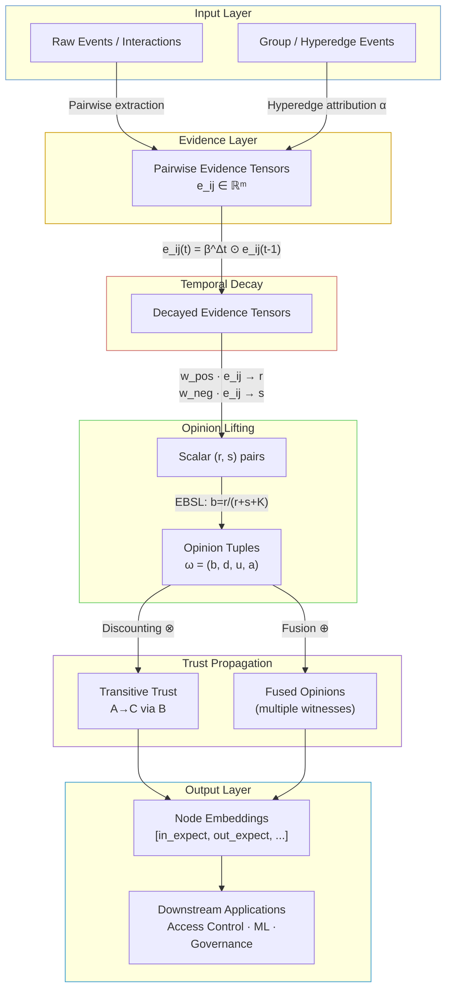
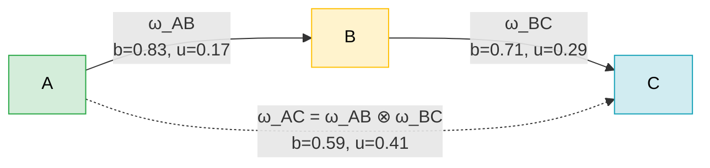
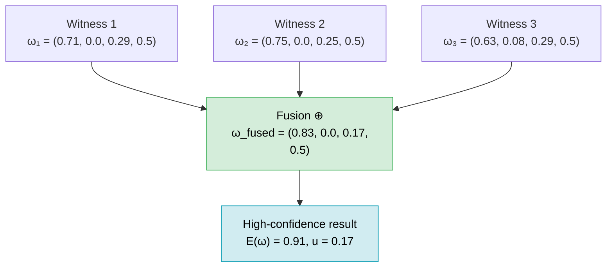
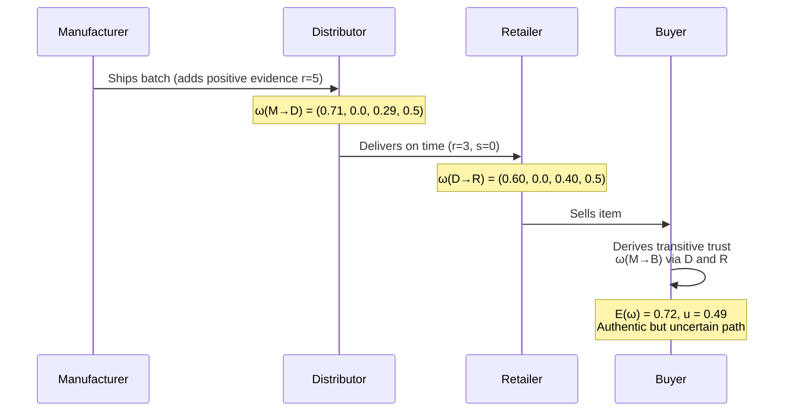
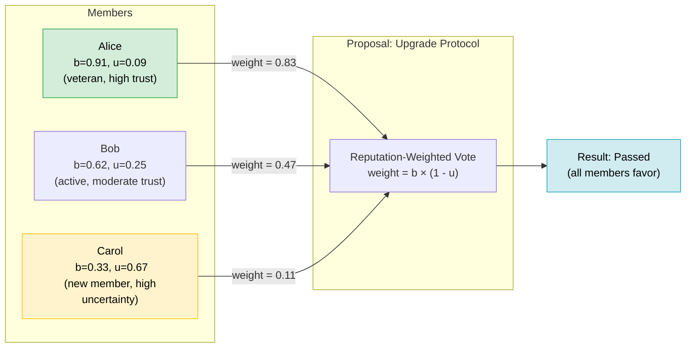
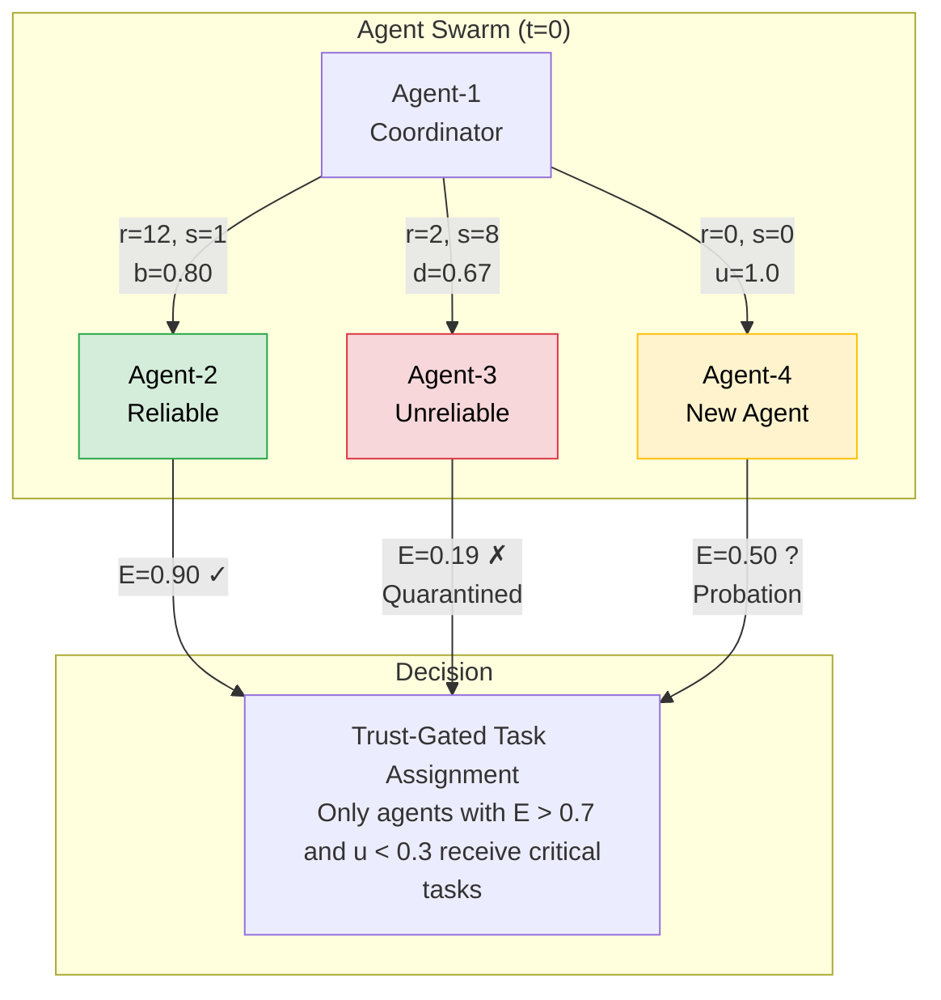
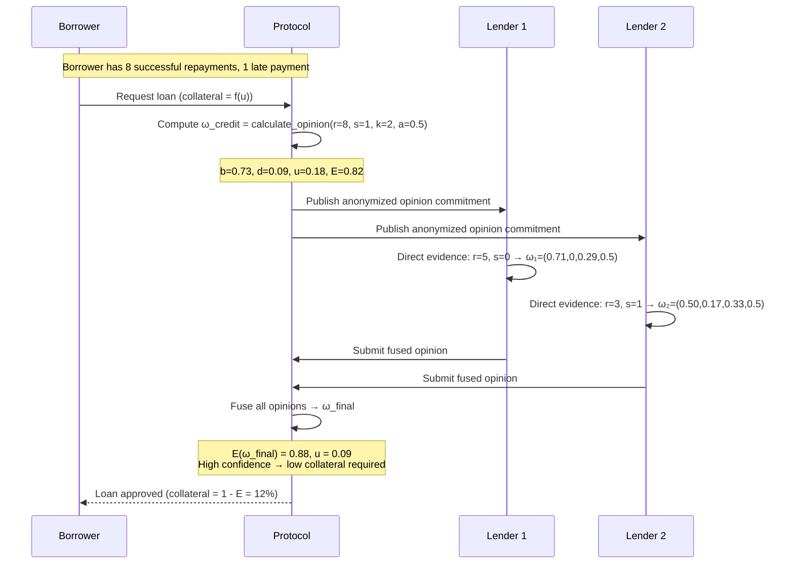

# EQBSL (Rust Crate)

A Rust implementation of the **Evidence-Based Quantum-resistant Belief State Logic (EQBSL)** framework — a mathematically rigorous system for reasoning about trust, reputation, and epistemic uncertainty in distributed systems.

Unlike traditional scalar trust scores (e.g., a 5-star rating or a credit score), EQBSL represents trust as a rich **Opinion Tuple** `ω = (b, d, u, a)` that captures not just *how much* you trust something, but *how confident* you are in that assessment.

---

## Table of Contents

- [Core Concepts](#core-concepts)
- [Architecture](#architecture)
- [Features](#features)
- [Installation](#installation)
- [Quick Start](#quick-start)
- [API Reference](#api-reference)
- [Real-World Examples](#real-world-examples)
  - [Supply Chain Provenance](#example-1-supply-chain-provenance)
  - [DAO Reputation-Weighted Voting](#example-2-dao-reputation-weighted-voting)
  - [AI Agent Swarm Trust](#example-3-ai-agent-swarm-trust)
  - [Peer-to-Peer Lending](#example-4-peer-to-peer-lending)
- [Running Tests](#running-tests)
- [License](#license)

---

## Core Concepts

### The Opinion Tuple `ω = (b, d, u, a)`

Every trust relationship is represented as a four-component opinion:

| Component | Symbol | Meaning |
|-----------|--------|---------|
| Belief    | `b`    | Weight of positive evidence supporting the proposition |
| Disbelief | `d`    | Weight of negative evidence against the proposition |
| Uncertainty | `u`  | Lack of evidence; starts at 1.0, shrinks as evidence accumulates |
| Base Rate | `a`    | Prior probability in the absence of any evidence |

**Invariant:** `b + d + u = 1.0` always holds.

### Evidence-to-Opinion Mapping

Raw evidence counts `(r, s)` map directly to an opinion using the EBSL formula:

```
b = r / (r + s + K)
d = s / (r + s + K)
u = K / (r + s + K)
```

where `K` is a protocol constant (default `K = 2`) representing the prior weight. As evidence accumulates, `u → 0` and `b` or `d` approaches 1.

### Expected Probability

The **expectation** `E(ω) = b + a·u` gives a single scalar summary: your best estimate of the probability that the proposition is true, accounting for both evidence and the prior.

---

## Architecture

### Evidence-to-Trust Pipeline



### Transitive Trust (Discounting)

When A trusts B, and B has an opinion about C, A can derive an *indirect* opinion about C:



*Note:* Uncertainty increases through each hop — a natural property of transitive inference.

### Opinion Fusion (Consensus)

Multiple independent witnesses can be combined via the **Consensus operator ⊕**:



---

## Features

- **Subjective Logic Core**: Full `Opinion` type `(b, d, u, a)` with algebraically correct Consensus `⊕` and Discounting `⊗` operators.
- **Evidence-Based Mapping**: Direct mapping from evidence counts `(r, s)` to probabilistic opinions via `calculate_opinion`.
- **Vectorized Evidence (Tensors)**: `m`-dimensional evidence vectors per relationship — distinguish "late delivery" from "broken item" in a single tensor.
- **EQBSL Pipeline**:
  - **Temporal Decay**: Exponential decay `β^Δt` per evidence channel.
  - **Hyperedge Attribution**: Equal-weight distribution of group interaction evidence to all ordered pairs in the group.
  - **Transitive Propagation**: Depth-1 indirect evidence aggregation with top-K witness selection.
- **Trust Embeddings**: Deterministic 6-dimensional node embeddings for downstream ML tasks.
- **Serialization**: Full `serde` support for JSON / any serde-compatible format.

---

## Installation

Add this to your `Cargo.toml`:

```toml
[dependencies]
eqbsl = { path = "path/to/eqbsl" }
ndarray = "0.15"
```

---

## Quick Start

```rust
use eqbsl::*;

fn main() {
    // 1. Map evidence to an opinion
    // 10 positive observations, 0 negative, K=2, base rate=0.5
    let op_ab = calculate_opinion(10.0, 0.0, 2.0, 0.5);
    println!("Opinion A→B: {:?}", op_ab);
    // Opinion { b: 0.833, d: 0.0, u: 0.167, a: 0.5 }
    println!("Expectation: {:.3}", op_ab.expectation()); // 0.917

    // 2. Transitive Trust via Discounting (A trusts C through B)
    let op_bc = calculate_opinion(5.0, 0.0, 2.0, 0.5);
    let op_ac = op_ab.discount(&op_bc);
    println!("Opinion A→C (via B): {:?}", op_ac);

    // 3. Opinion Fusion: combine two independent witnesses
    let op_witness = calculate_opinion(8.0, 1.0, 2.0, 0.5);
    let op_fused = op_ac.fuse(&op_witness);
    println!("Fused Opinion: {:?}", op_fused);
    println!("Fused Expectation: {:.3}", op_fused.expectation());
}
```

---

## API Reference

### `Opinion`

```rust
pub struct Opinion { pub b: f64, pub d: f64, pub u: f64, pub a: f64 }
```

| Method | Description |
|--------|-------------|
| `Opinion::new(b, d, u, a)` | Construct and auto-normalize so `b+d+u=1` |
| `opinion.expectation()` | Returns `b + a·u` — best scalar estimate |
| `op1.fuse(&op2)` | Consensus operator `⊕`: combine two independent opinions |
| `op1.discount(&op2)` | Discounting operator `⊗`: propagate trust transitively |

### `calculate_opinion(r, s, k, a) -> Opinion`

Maps raw evidence counts to an opinion. Uses `K = DEFAULT_K = 2.0` by default.

### `Params`

Global system configuration. Call `params.validate()` before use.

```rust
Params {
    k: 2.0,                        // Prior weight (EBSL constant K)
    w_pos: array![1.0, 0.5],       // Positive evidence channel weights
    w_neg: array![0.0, 0.5],       // Negative evidence channel weights
    decay_beta: array![0.9, 0.9],  // Per-channel decay factor β ∈ (0,1]
    damping_lambda: 0.5,           // Transitive propagation damping
    witness_top_k: 10,             // Max witnesses per node for propagation
}
```

### Pipeline Functions

| Function | Description |
|----------|-------------|
| `State::new(t)` | Create an empty state at time `t` |
| `decay_state(&mut state, params, dt_steps)` | Apply `β^Δt` decay to all evidence |
| `attribute_hyperedges_to_pairs(&mut state)` | Distribute hyperedge evidence to pairwise edges |
| `compute_opinions(&state, params, base_rate)` | Lift all edges to `Opinion` tuples |
| `depth1_propagation_rs(nodes, opinions, edges, params)` | Add transitive evidence contributions |
| `embed_nodes_basic(nodes, opinions)` | Compute 6-dim trust embeddings per node |

---

## Real-World Examples

### Example 1: Supply Chain Provenance

A buyer wants to know whether a product is authentic. Each step in the supply chain (manufacturer → distributor → retailer) adds evidence. Evidence decays over time.



```rust
use eqbsl::*;

fn supply_chain_example() {
    // Multi-channel evidence: [quality_checks, on_time_deliveries]
    let params = Params {
        k: 2.0,
        w_pos: array![0.7, 0.3],  // quality matters more
        w_neg: array![0.5, 0.5],
        decay_beta: array![0.95, 0.90], // quality decays slower than timeliness
        damping_lambda: 0.7,
        witness_top_k: 5,
    };

    let mut state = State::new(0);

    // Manufacturer → Distributor: 5 quality checks passed, 2 on-time deliveries
    state.edges.insert(
        ("manufacturer".into(), "distributor".into()),
        array![5.0, 2.0],
    );
    // Distributor → Retailer: 3 quality checks, 4 on-time deliveries
    state.edges.insert(
        ("distributor".into(), "retailer".into()),
        array![3.0, 4.0],
    );

    // Simulate 10 days of decay
    decay_state(&mut state, &params, 10);

    // Lift to opinions
    let opinions = compute_opinions(&state, &params, 0.5);

    // Direct trust: manufacturer → distributor
    let op_md = opinions[&("manufacturer".into(), "distributor".into())];
    println!("Manufacturer→Distributor: b={:.3}, u={:.3}, E={:.3}",
        op_md.b, op_md.u, op_md.expectation());

    // Transitive trust: manufacturer → retailer via distributor
    let nodes = vec!["manufacturer".to_string(), "distributor".to_string(), "retailer".to_string()];
    let propagated = depth1_propagation_rs(&nodes, &opinions, &state.edges, &params);
    let (r, s) = propagated[&("manufacturer".into(), "retailer".into())];
    let op_mr = calculate_opinion(r, s, params.k, 0.5);
    println!("Manufacturer→Retailer (transitive): b={:.3}, u={:.3}, E={:.3}",
        op_mr.b, op_mr.u, op_mr.expectation());
}
```

---

### Example 2: DAO Reputation-Weighted Voting

In a decentralized autonomous organization, members vote on proposals. Rather than "one token one vote" (plutocracy) or "one person one vote" (Sybil-vulnerable), EQBSL weights votes by each member's *certainty-adjusted reputation*.



```rust
use eqbsl::*;

struct Member { name: String, opinion: Opinion }

fn dao_voting_example() {
    // Opinions derived from on-chain interaction history
    let members = vec![
        Member { name: "alice".into(), opinion: calculate_opinion(20.0, 0.0, 2.0, 0.5) },
        Member { name: "bob".into(),   opinion: calculate_opinion(5.0,  1.0, 2.0, 0.5) },
        Member { name: "carol".into(), opinion: calculate_opinion(1.0,  0.0, 2.0, 0.5) },
    ];

    // Vote weight: belief × certainty (1 - uncertainty)
    let total_weight: f64 = members.iter()
        .map(|m| m.opinion.b * (1.0 - m.opinion.u))
        .sum();

    println!("=== DAO Vote: Protocol Upgrade ===");
    for m in &members {
        let weight = m.opinion.b * (1.0 - m.opinion.u);
        println!("  {}: E={:.3}, weight={:.3} ({:.1}%)",
            m.name,
            m.opinion.expectation(),
            weight,
            100.0 * weight / total_weight);
    }

    // Fuse all member opinions to get the DAO's collective reputation state.
    // This consensus opinion represents how much the group as a whole is trusted
    // by an outside observer, not the vote outcome itself.
    let consensus = members.iter().skip(1).fold(members[0].opinion, |acc, m| acc.fuse(&m.opinion));
    println!("Consensus opinion: b={:.3}, u={:.3}, E={:.3}",
        consensus.b, consensus.u, consensus.expectation());
    println!("Proposal {}", if consensus.expectation() > 0.6 { "PASSED" } else { "REJECTED" });
}
```

---

### Example 3: AI Agent Swarm Trust

In a swarm of AI agents performing distributed inference tasks, agents accumulate positive evidence for peers that produce correct outputs and negative evidence for peers that hallucinate or behave maliciously.



```rust
use eqbsl::*;

fn ai_swarm_trust_example() {
    // Evidence channels: [task_correctness, response_latency_ok, format_compliance]
    let params = Params {
        k: 2.0,
        w_pos: array![0.6, 0.2, 0.2],
        w_neg: array![0.7, 0.1, 0.2],
        decay_beta: array![0.98, 0.95, 0.99], // correctness decays slowly
        damping_lambda: 0.6,
        witness_top_k: 3,
    };

    let mut state = State::new(100); // t=100 (current step)

    // Coordinator's evidence about peers.
    // NOTE: The diagram above uses simplified scalar (r, s) counts for illustration.
    // The actual computation uses 3-channel weighted evidence vectors, so the
    // numeric opinion values produced by the code will differ from the diagram labels.
    state.edges.insert(("coord".into(), "agent_2".into()), array![12.0, 8.0, 10.0]);
    state.edges.insert(("coord".into(), "agent_3".into()), array![2.0, 9.0, 1.0]);
    state.edges.insert(("coord".into(), "agent_4".into()), array![0.0, 0.0, 0.0]);

    // Group task: agents 2, 3, 4 collaborated on a task
    let mut h = std::collections::HashMap::new();
    h.insert("agent_2".to_string(), "executor".to_string());
    h.insert("agent_3".to_string(), "executor".to_string());
    state.hypers.insert("task_42".into(), Hyperedge {
        hid: "task_42".into(),
        nodes: vec!["agent_2".into(), "agent_3".into()],
        roles: h,
        e: array![1.0, 0.5, 1.0], // positive group evidence
    });
    attribute_hyperedges_to_pairs(&mut state);

    let opinions = compute_opinions(&state, &params, 0.5);

    println!("=== AI Swarm Trust Assessment ===");
    let agents = ["agent_2", "agent_3", "agent_4"];
    for agent in &agents {
        let key = ("coord".to_string(), agent.to_string());
        if let Some(op) = opinions.get(&key) {
            let status = if op.expectation() > 0.7 && op.u < 0.3 {
                "✓ TRUSTED - eligible for critical tasks"
            } else if op.expectation() < 0.4 {
                "✗ QUARANTINED"
            } else {
                "? PROBATION - monitoring"
            };
            println!("  {}: b={:.3}, d={:.3}, u={:.3}, E={:.3} => {}",
                agent, op.b, op.d, op.u, op.expectation(), status);
        } else {
            println!("  {}: no evidence => u=1.0, E=0.5 => ? PROBATION", agent);
        }
    }
}
```

---

### Example 4: Peer-to-Peer Lending

A decentralized lending protocol needs creditworthiness scores. EQBSL models credit as a belief state that accumulates over repayment history and decays over time.



```rust
use eqbsl::*;

fn p2p_lending_example() {
    // Borrower's direct repayment history: 8 on-time, 1 late
    let direct = calculate_opinion(8.0, 1.0, 2.0, 0.5);
    println!("Borrower credit (direct): b={:.3}, d={:.3}, u={:.3}, E={:.3}",
        direct.b, direct.d, direct.u, direct.expectation());

    // Two lenders have independent evidence
    let lender1 = calculate_opinion(5.0, 0.0, 2.0, 0.5);
    let lender2 = calculate_opinion(3.0, 1.0, 2.0, 0.5);

    // Fuse all three independent opinions
    let fused = direct.fuse(&lender1).fuse(&lender2);
    println!("Fused credit opinion: b={:.3}, d={:.3}, u={:.3}, E={:.3}",
        fused.b, fused.d, fused.u, fused.expectation());

    // Required collateral inversely proportional to trust certainty
    let collateral_rate = 1.0 - fused.expectation();
    println!("Required collateral rate: {:.1}%", collateral_rate * 100.0);
    // → 12.3% collateral (high trust, low uncertainty)

    // Compare: new borrower (no history) requires much more collateral
    let new_borrower = calculate_opinion(0.0, 0.0, 2.0, 0.5);
    let new_collateral = 1.0 - new_borrower.expectation();
    println!("New borrower collateral rate: {:.1}%", new_collateral * 100.0);
    // → 50.0% collateral (maximum uncertainty)
}
```

---

## Running Tests

```bash
# Run all tests
cargo test

# Run a specific example
cargo run --example basic_usage

# Run with output visible
cargo test -- --nocapture
```

---

## Comparison: EQBSL vs. Traditional Trust Systems

| Feature | Traditional Score | Web-of-Trust | EQBSL |
|:--------|:-----------------|:-------------|:------|
| Representation | Scalar (e.g., 4.2 ★) | Boolean | **Tuple (b, d, u, a)** |
| Uncertainty modeling | ✗ | ✗ | **✓ Explicit via `u`** |
| Evidence dimensionality | Scalar | None | **m-dimensional tensors** |
| Transitivity | Proprietary | Manual chains | **Formal Discounting ⊗** |
| Multi-witness fusion | Weighted avg | None | **Algebraic Consensus ⊕** |
| Temporal decay | Ad-hoc | None | **Per-channel β^Δt** |
| Sybil resistance | KYC | Introducer trust | **Partial† (via uncertainty)** |
| Serializable / portable | Partial | ✗ | **✓ Full serde support** |

† EQBSL does not itself provide Sybil resistance; it computes trust (opinions) over observed events. Its explicit modeling of epistemic uncertainty about new or unknown identities can inform downstream Sybil-resistance policies, but it is not a Sybil-resistance mechanism on its own.

---

## License

MIT
